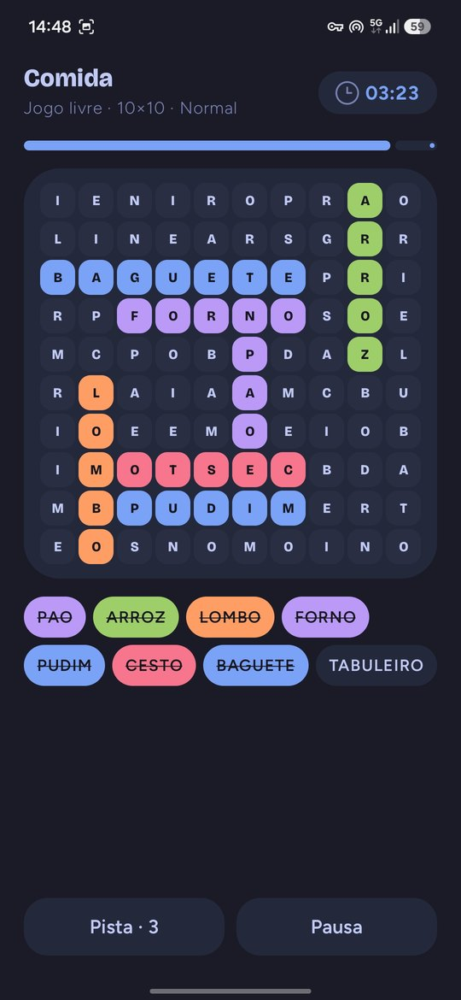
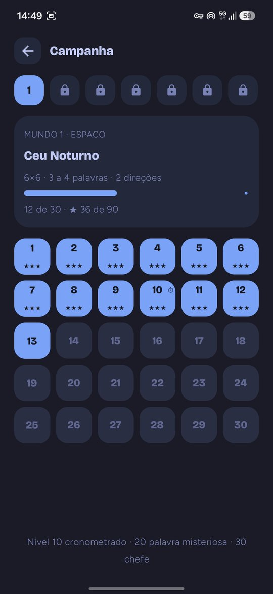
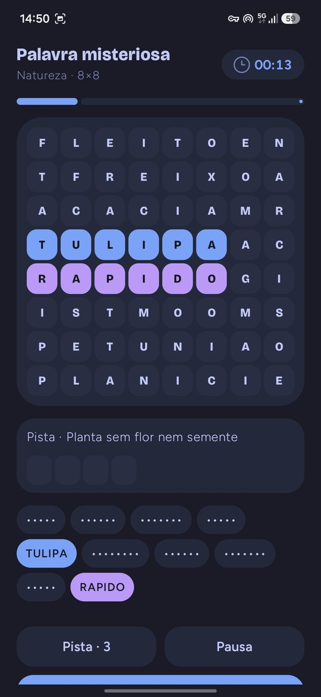
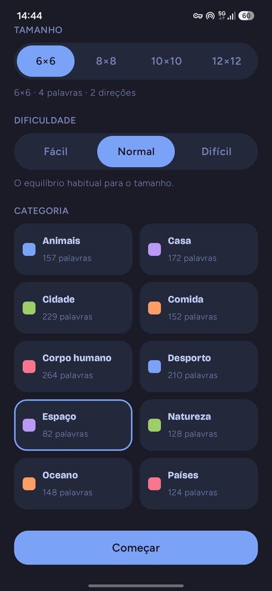
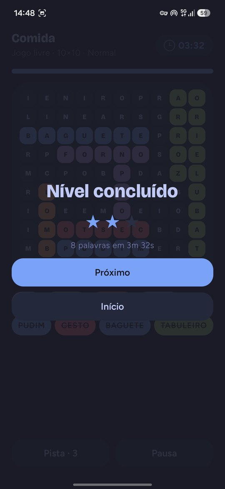
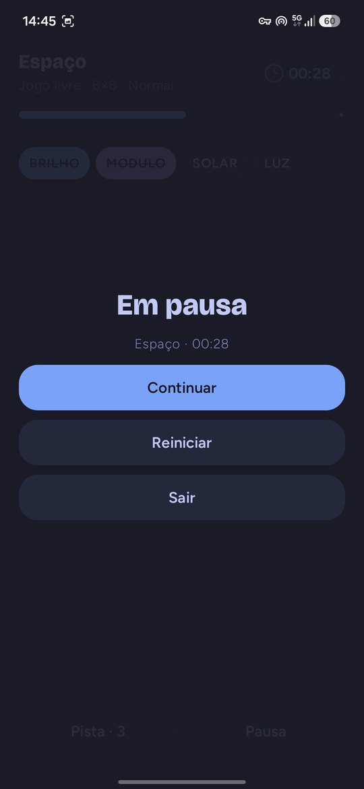
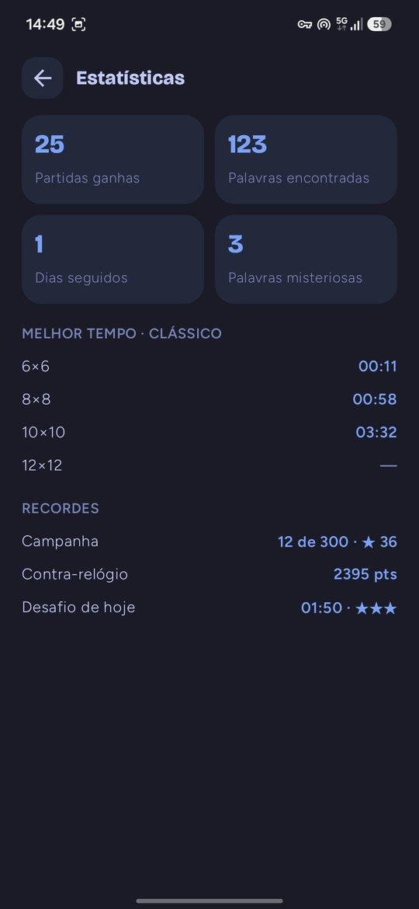
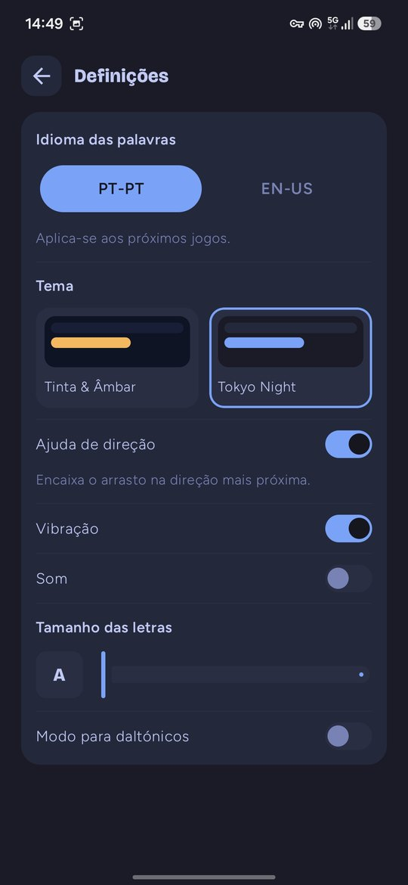

<div align="center">

# Sopa de Letras

**Sopa de letras para Android, feita em Kotlin e Jetpack Compose.**
Campanha de 300 níveis, desafio diário, contra-relógio e palavra misteriosa — em português e inglês, sem anúncios e sem internet.

[](https://github.com/SyscallBrain/SopaDeLetras/actions/workflows/ci.yml)
[](LICENSE)


  

</div>

## Funcionalidades

- **Campanha** com 300 níveis em 10 mundos, desbloqueio progressivo, até 3 estrelas por nível, níveis cronometrados e chefes.
- **Jogo livre**: tabuleiros 6×6, 8×8, 10×10 e 12×12, três dificuldades (no Difícil as palavras aparecem nas 8 direções) e 10 categorias.
- **Desafio diário**: o mesmo puzzle para toda a gente, gerado a partir da data.
- **Contra-relógio**: encontra o máximo de palavras antes do tempo acabar.
- **Palavra misteriosa**: palavras por descobrir no tabuleiro, uma pista e uma palavra secreta para adivinhar.
- **Dois idiomas de palavras**: pt-PT e en-US, com cerca de 1 700 e 1 900 palavras respetivamente.
- **Pistas**, estatísticas, melhores tempos e recordes.
- **Acessibilidade**: modo para daltónicos, tamanho de letra ajustável, ajuda de direção no arrasto e suporte a TalkBack.
- **Privacidade**: funciona 100 % offline. A única permissão é a vibração.
- Dois temas escuros, sons gerados por código (sem ficheiros de terceiros) e layouts adaptados a telemóveis e tablets.

## Screenshots

<table>
  <tr>
    <td align="center"><br><sub>Novo jogo</sub></td>
    <td align="center"><br><sub>Jogo</sub></td>
    <td align="center"><br><sub>Nível concluído</sub></td>
    <td align="center"><br><sub>Pausa</sub></td>
  </tr>
  <tr>
    <td align="center"><br><sub>Campanha</sub></td>
    <td align="center"><br><sub>Palavra misteriosa</sub></td>
    <td align="center"><br><sub>Estatísticas</sub></td>
    <td align="center"><br><sub>Definições</sub></td>
  </tr>
</table>

## Instalar

Descarrega o APK mais recente em [Releases](https://github.com/SyscallBrain/SopaDeLetras/releases/latest) e abre-o no telemóvel (é preciso permitir a instalação de fontes desconhecidas). Requer Android 8.0 ou superior.

## Compilar

Requisitos:

- JDK 17 ou superior (o do Android Studio serve)
- Android SDK com a plataforma 37 (`compileSdk`) e `ANDROID_HOME` definido, ou um `local.properties` com `sdk.dir`
- Python 3 (a validação dos bancos de palavras corre antes dos testes)

```bash
git clone https://github.com/SyscallBrain/SopaDeLetras.git
cd SopaDeLetras

./gradlew assembleDebug        # APK em app/build/outputs/apk/debug/
./gradlew installDebug         # instala num dispositivo ou emulador ligado
./gradlew testDebugUnitTest    # testes unitários (inclui tools/validate_words.py)
```

Também podes abrir a pasta no Android Studio e correr a configuração `app`.

> O build `release` (`./gradlew assembleRelease`, com R8) está assinado com a chave de debug para facilitar testes locais. Para distribuir a tua própria versão, configura uma `signingConfig` com o teu keystore em `app/build.gradle.kts`.

## Arquitetura

```
app/src/main/java/app/sopadeletras/
  core/        Kotlin puro, sem Android: gerador de puzzles, seleção, pontuação,
               campanha, desafio diário e dificuldade
  data/        WordRepository (assets JSON), SettingsStore e GameDataStore (DataStore)
  ui/          tema, componentes e ecrãs (início, campanha, novo jogo, jogo,
               contra-relógio, palavra misteriosa, estatísticas, definições)
  feedback/    vibração e sons
app/src/main/assets/words/<pt-PT|en-US>/*.json   10 categorias por idioma
tools/
  validate_words.py   valida formato, contagens e listas de palavras excluídas
  make_sounds.py      gera os sons da app
design/               protótipo HTML e gerador de referência em JS
```

- **Gerador determinístico**: o gerador usa um PRNG Mulberry32 e é portado do protótipo em JavaScript (`design/`). Os testes comparam o tabuleiro gerado, byte a byte, com a referência. Por isso o desafio diário é igual em todos os dispositivos.
- **Interface 100 % Compose** com Material 3 e Navigation Compose.
- **Desempenho**: o arrasto no tabuleiro 12×12 corre a 60 fps. Cada célula só recompõe quando o seu estado muda e o caminho do ponteiro não aloca memória.
- **Persistência** com Jetpack DataStore.

## Contribuir

Contribuições são bem-vindas: correções, novas palavras ou categorias, traduções, acessibilidade, ideias novas.

1. Faz fork e cria um branch a partir de `main`.
2. Corre `./gradlew testDebugUnitTest` antes de abrir o pull request.
3. Para palavras novas, edita os ficheiros em `app/src/main/assets/words/` e corre `python3 tools/validate_words.py`.
4. Abre um pull request com uma descrição clara do que muda e porquê. Para mudanças maiores, abre primeiro uma issue.

O código está em inglês e a interface em português europeu.

## Créditos

- Tipos de letra [Bricolage Grotesque](https://fonts.google.com/specimen/Bricolage+Grotesque) e [Figtree](https://fonts.google.com/specimen/Figtree), sob a [SIL Open Font License 1.1](https://openfontlicense.org).
- Sons gerados por código em `tools/make_sounds.py`.

## Licença

Distribuído sob a licença [MIT](LICENSE).
